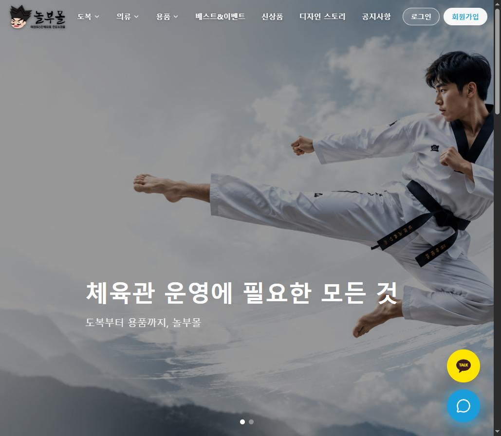
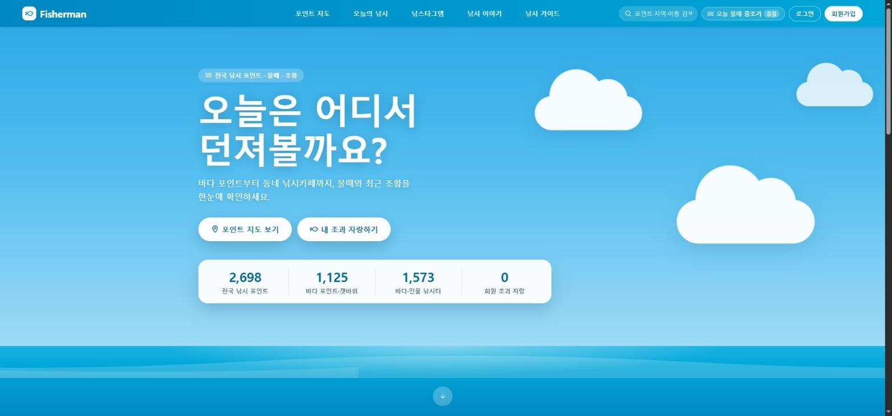

# 안녕하세요, 개발자 인연준입니다 👋

직접 기획하고, 만들고, 배포까지 하는 웹 개발자입니다.

## 🛠 Tech Stack

## 🚀 Projects

### 🥋 놀부몰 — [nolbumall.com](https://nolbumall.com/)
태권도 도복·띠·단체복·보호장비 전문 쇼핑몰

- Spring Boot + React + MySQL
- 문자(SMS) 본인인증 회원가입, 관리자 상품/이미지 관리, 배송비 정책, SEO 적용

### 💰 내 월급으로 살아남기 — [mywolgeup.com](https://mywolgeup.com/)
월급 기반 개인 재정 진단 서비스

- React + Vite
- 연봉 실수령액 계산, 퇴사 후 버틸 수 있는 기간 시뮬레이션, 월 소비 진단, 구매 판단 도우미

### 🎣 Fisherman — [fisherman-ecno.onrender.com](https://fisherman-ecno.onrender.com/)
낚시 통합 정보 사이트

- Spring Boot + MySQL, 공공데이터포털 API, 네이버 로그인
- 전국 낚시 포인트 지도, 물때·날씨 정보, 조과 공유, 낚시 커뮤니티

## 📊 GitHub Stats

